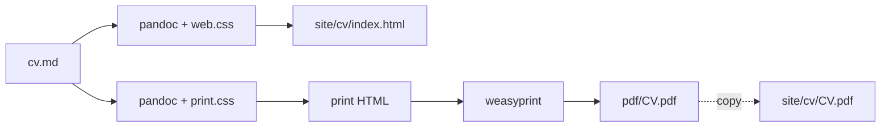

# CV Pipeline — Technical Design

**Status:** Draft v0.5
**Date:** 2026-08-19
**Scope:** Single-source-of-truth CV → static personal website + single-page PDF

---

## 1. Context

We maintain one CV in Markdown (`cv.md`) and need two artifacts derived from it:

1. **A static personal website** (`site/`) — simple landing page, a longer formatted
   HTML version of the CV, and a downloadable single-page PDF of the CV. A Tally form
   will be embedded (added later, zero code).
2. **A single-page PDF** (`pdf/`) — compact one-pager distributed in job applications.

## 2. Goals / Non-Goals

### Goals

- **One source of truth** — a change to `cv.md` is the only edit needed; everything else is generated.
- **Minimal custom code** — a single small build script; all heavy lifting delegated to mature tools.
- **Fully static output** — `site/` is plain HTML/CSS/PDF; deployable anywhere with no build step.
- **Reproducible, project-scoped toolchain** — Python and tool versions pinned by `mise`, dependencies managed by `uv`.

### Non-Goals

- **No custom-built tooling.** Never write our own markdown renderer, HTML template engine,
  PDF engine, or dev server.
- No CMS, no database, no backend, no forms backend (Tally handles forms).
- No CI/CD pipeline for now — build locally, push static files. (Optional CI is a future step, see §9.)
- No multi-page site; the website is intentionally small.

### Constraints

- **No reinventing the wheel.** Using an existing tool is always preferred — pandoc,
  WeasyPrint, Vite, live-server, Chromium headless, whatever fits — what is forbidden is
  rebuilding any of them from scratch.
- **No pipx, no uvx, no global installs.** All tooling lives inside the project:
  `mise` pins tool versions in `.mise.toml`, `uv` keeps Python deps in `.venv`/`uv.lock`.
  Nothing is installed system-wide for this project.
- **As little custom code as possible.**

## 3. Architecture



The core idea: **the CV is rendered to HTML once and styled twice.**

- `styles/web.css` — roomier typography, all sections visible → the longer web version.
- `styles/print.css` — A4, compact type, forced to a single page → the jobhunt PDF.

**pandoc** replaces the custom markdown parsing: it reads the YAML frontmatter natively
and renders the body through a small template. **WeasyPrint** handles the print side with
full `@page` CSS control. Our only custom code is a ~8-line build script and a ~15-line
HTML template.

No content duplication between the two outputs: same markdown, different stylesheet.
The full CV won't fit one A4 page, so the print version is a **subset** of the same
source: sections marked `.no-print` are dropped from the PDF only (see §4.1).

## 4. Source of truth: `cv.md`

Markdown with YAML frontmatter. The frontmatter is the **contract** the build reads;
pandoc exposes each field to the template as a variable:

| Field         | Consumed as                                            |
|---------------|--------------------------------------------------------|
| `name`        | Page title / PDF header                                |
| `title`       | Subtitle under name                                    |
| `location`    | Contact line                                           |
| `website`     | Contact line (link)                                    |
| `github`      | Contact line (link)                                    |
| `url`         | Canonical URL for the site                             |
| `linkedin`    | Contact line (link)                                    |
| `description` | Meta description + PDF header tagline                  |
| body          | Sections: Summary, Experience, Education, Skills, Selected Projects |

Body structure follows the existing heading conventions:
`#` for sections, `##` for entries, bold + italic + lists as already used.
New sections are added as `# Heading` and appear automatically in both outputs.

### 4.1 Print subset control

The full CV likely won't fit one A4 page, so the PDF uses a **subset**: the same
`cv.md`, minus sections marked for omission. No second source file, no duplication,
no drift between versions.

Marking is done natively in Markdown with **fenced divs** — pandoc renders them as
`<div class="no-print">`:

```markdown
::: {.no-print}
# Selected Projects

…content…
:::
```

- `print.css` adds one rule: `.no-print { display: none; }` — the section vanishes
  from the PDF; WeasyPrint re-flows the page.
- `web.css` ignores the class — the website still shows the full, longer CV.
- Granularity is uniform: wrap a whole section *or* a single `##` entry (e.g.
  dropping an early role) — same mechanism, no options to configure.

**Rejected alternative (for now):** a TOML/YAML toggle list (e.g.
`print.exclude = [...]`) requires a build-time filter — either a pandoc Lua filter
(~10 lines) or a section-stripping step in `build.sh` — i.e. custom code. Inline
markers cost zero code and travel with the content they affect. If print ever needs
**rewritten** content (different wording, not just omission), revisit: that is the
point where a config-driven variant mechanism earns its keep.

## 5. Build: `Makefile`

The Makefile is the **single command surface**. `make` builds everything; file
prerequisites make it incremental (only what changed is rebuilt). The heavy
lifting stays in pandoc (frontmatter → HTML) and WeasyPrint (HTML → PDF):

1. **Web:** `pandoc cv.md --template templates/cv.html --css styles/web.css --embed-resources`
   → `site/cv/index.html` (standalone; CSS inlined, no path coupling).
2. **Print HTML:** same invocation with `styles/print.css` → `build/cv-print.html`.
3. **PDF:** `uv run python build_pdf.py` renders WeasyPrint → `pdf/CV.pdf` **and
   enforces the one-page rule** — it aborts with a message if the result is not a
   single page.
4. **Distribute:** copy `pdf/CV.pdf` → `site/cv/CV.pdf` so the site hosts the download.

`--embed-resources` is not optional: without it, the stylesheet `<link>` resolves
relative to the output file and WeasyPrint fails to load it (observed in the PoC).

No custom frontmatter parsing, no template logic — pandoc's template engine does it.

### `templates/cv.html`

A minimal pandoc template (~15 lines): `<head>` with title/description from frontmatter,
a contact header (name, title, location, links), then `$body$`.

### 5.1 PoC validation (2026-08-19)

A throwaway spike ran the actual toolchain on the real `cv.md`:

| Check | Result |
|---|---|
| Frontmatter → template vars (`$name$`, `$title$`, `$description$`, links) | ✅ resolved |
| `--embed-resources` CSS inlining | ✅ single inlined `<style>` block |
| Full CV on one A4 page (pandoc 3.10, weasyprint 69) | ✅ **1 page** at 9.5pt / 9mm margins |
| All sections present in PDF text layer | ✅ 5 roles + education + skills + 4 projects |

Conclusion: the unmodified `cv.md` fits one page with the spike stylesheet — the
`.no-print` subset mechanism (§4.1) is **not needed yet**; it stays as the overflow
escape hatch if the CV grows. The printed header/typography is a first draft;
polishing it is styling work, not structural risk.

## 6. Styling strategy

### `styles/web.css`

- Long-form layout: generous font size (~16px), max-width column, visible links, section spacing.
- Print content is not hidden on web — web shows everything (the "longer" version).

### `styles/print.css`

The single-page contract. Techniques to guarantee one page:

- `@page { size: A4; margin: 10mm 12mm; }`
- `.no-print { display: none; }` — drops sections marked in the source (see §4.1).
- Base font ~9.5pt, tight line-height (~1.35), compact heading margins.
- `break-inside: avoid` on experience/education entries.
- Skills rendered as compact inline chips (grid/flex), not blocky lists.
- Contact header as one dense line (name, title, links separated by `·`).

## 7. Toolchain: `mise` + `uv`

Installed on this machine: `mise 2026.8.8`, `uv 0.12.5`, `Python 3.14.7`,
`WeasyPrint 69.0` (Homebrew), pandoc installable via `mise`.

Role split:

- **`mise`** — pins the one version-sensitive tool (pandoc).
- **`uv`** — owns the Python side: creates the project venv and installs/locks
  dependencies (incl. WeasyPrint).
- **`Makefile`** — the only user-facing command surface (`make`, `make pdf`, …).

### `mise.toml` (project root)

```toml
[tools]
pandoc = "3"
```

pandoc is pinned because its template/metadata behavior varies by version. Python
is delegated to `uv` (`requires-python` in `pyproject.toml`) rather than pinned in
`mise`, so each concern has exactly one owner. `mise run` tasks were considered
and dropped in favor of the Makefile as the single interface (decision recorded in
README).

### `pyproject.toml` (project root)

```toml
[project]
name = "cv-site"
version = "0.1.0"
requires-python = ">=3.13"
dependencies = [
    "weasyprint",
]

[tool.uv]
package = false   # dependency-only project; nothing to build/install
```

`uv.lock` is generated on first `uv sync`.

### Global-install policy (enforced)

- `mise` installs tool binaries **per project** (`.mise.toml`), not system-wide.
- `uv` keeps Python deps in the project `.venv/`, never `pip install -g`, never
  `uvx`, never `pipx`.
- The Homebrew `weasyprint` currently on this machine is fine to leave installed,
  but the pipeline resolves it from the project venv.

### Prerequisite note (macOS)

WeasyPrint needs system Pango/Cairo libraries, already present on this machine.
If the environment is ever rebuilt: `brew install pango`.

## 8. Outputs

### `site/` — static website (subdir 1)

```
site/
├── index.html              # hand-written landing page (embeds Tally contact form)
├── favicon.svg             # hand-written asset (optional)
└── cv/
    ├── index.html          # generated: longer HTML CV (web.css)
    └── CV.pdf              # generated: single-page download
```

Everything in `site/` is committed to git and uploadable to any static host
with **zero build steps**.

**Self-containment rule:** nothing inside `site/` may reference a file outside it.
The generated CV page inlines its styles via `--embed-resources`; the landing
page carries its own `<style>` block. This keeps the whole directory directly
uploadable with no path fixes.

### `pdf/` — jobhunt output (subdir 2)

```
pdf/
└── CV.pdf                  # generated: single-page A4, ATS-friendly text
```

Consumed directly by job applications; also copied into `site/cv/` for the
website download.

### `.gitignore`

```
__pycache__/
.venv/
build/
```

Generated artifacts (`site/`, `pdf/`) are **committed** on purpose: pushing the
repo deploys the site and updates the PDF everywhere at once. `build/` is scratch
(intermediate print HTML).

## 9. Workflow

Updating the CV (the only day-to-day operation):

1. Edit `cv.md`.
2. `make` (the one-page guard fails loudly if the PDF overflows).
3. Verify: open `site/index.html` in a browser; the guard already enforces
   `pdf/CV.pdf` is one page.
4. Push. Site deploys on the static host; PDF in repo is current.

Local preview (optional): `make serve` runs the stdlib HTTP server on `site/`;
otherwise the site navigates directly from disk.

### Optional future: CI

If the CV changes often, a GitHub Action can run `make` and push the
generated `site/` — but this is deliberately out of scope for v0.1.

## 10. Deployment

Any static host pointed at `site/`. Candidates (no build step required):

- **GitHub Pages** (already used for `cellsv`)
- **Vercel** (already used)
- **Netlify**

## 11. Tally form

Installed (2026-08-19): Tally's iframe + loader script pasted into the contact
section of `site/index.html` — zero build involvement, the form lives only on
the landing page. Updating the form (e.g. swapping the block ID `A76LDN`) is a
one-line edit in that file.

## 12. Open decisions

1. **Print subset** — PoC shows the full `cv.md` already fits one A4 page, so no
   omissions are needed today. The inline `.no-print` marker mechanism (§4.1)
   stands as the escape hatch for future growth. Revisit only if the CV grows
   past one page or needs rewritten print wording (variants would reintroduce a
   config-driven mechanism).
2. **PDF filename** — stable (`MatiasAgelvis-CV.pdf`) vs. date-stamped copies per
   jobhunt round (`MatiasAgelvis-CV-2026-08.pdf`). Affects `site/cv/` download URL.
3. **Hosting** — GitHub Pages vs. Vercel vs. Netlify for `site/`.

*(PDF engine is settled: pandoc → HTML → WeasyPrint. Whether pandoc drives WeasyPrint
directly via `--pdf-engine` or `build.sh` calls it separately is an implementation detail.)*