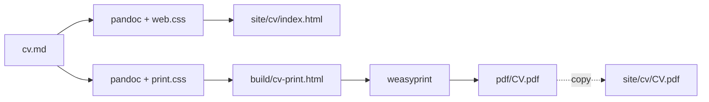

# Matias Agelvis — CV Pipeline

One markdown file (`cv.md`) is the single source of truth. From it we produce:

- a **static personal website** in `site/` (landing page + a longer HTML CV + a downloadable one-page PDF),
- a **single-page A4 PDF** in `pdf/` for job applications.

## Quick start

```sh
make            # build site/cv/index.html + pdf/CV.pdf (one page enforced)
make web        # only the HTML CV page
make pdf        # only the PDF (+ copy into the site)
```

Then just open `site/index.html` in a browser. No server needed — every link is a
real file, so the whole site navigates from `file://`.

Edit the CV, rebuild, reopen:

1. edit `cv.md`
2. `make`
3. re-open `site/index.html`

## How it works



The CV is rendered to HTML **once** and styled **twice**:

- `styles/web.css` — roomier, everything visible → the longer web version.
- `styles/print.css` — compact A4, forced to one page → the jobhunt PDF.

`build_pdf.py` (run by `make pdf`) renders the PDF through WeasyPrint and **aborts
with a clear message if the result is not exactly one page**, so overflow can never
slip by silently.

## Requirements

- [mise](https://mise.jdx.dev) — pins `pandoc`.
- [uv](https://github.com/astral-sh/uv) — creates `.venv`, installs `weasyprint`
  (from `pyproject.toml`). Nothing is installed globally; no `pipx`, no `uvx`, no
  `pip install -g`.
- macOS: WeasyPrint needs system Pango (`brew install pango`).

```sh
mise install
uv sync        # first run only; make will also do this on demand
```

## Project layout

```
cv.md                  # single source of truth (frontmatter + markdown body)
Makefile               # the one command surface: make / make web / make pdf
build_pdf.py           # WeasyPrint render + one-page guard
pyproject.toml         # deps (uv) — currently just weasyprint
mise.toml              # tool version pins (pandoc)
templates/cv.html      # pandoc template (frontmatter vars → HTML layout)
styles/web.css         # website styling
styles/print.css       # single-page PDF styling
site/                  # generated website — uploadable as-is, self-contained
├── index.html         # hand-written landing page (+ Tally contact form)
├── web.css            # shared site stylesheet (copied by `make web`)
└── cv/
    ├── index.html     # generated longer HTML CV (styles inlined)
    └── CV.pdf         # generated single-page PDF (download)
pdf/CV.pdf             # generated jobhunt PDF (source of the site copy)
build/                 # scratch (intermediate print HTML)
```

## Design decisions

1. **One source of truth.** Every change is an edit to `cv.md`; everything else is
   generated. No duplicated CV files to drift.
2. **No reinventing the wheel.** We use pandoc (markdown/text → HTML) and WeasyPrint
   (HTML+CSS → PDF). The sin is *building* a replacement, never *using* one.
3. **`Makefile` is the only command interface.** `mise` pins tool versions; `uv`
   manages dependencies; the Makefile is what you actually type. (mise tasks were
   considered and dropped to keep a single, familiar surface.)
4. **One HTML, two stylesheets.** The web and PDF versions share the same rendered
   markdown; only the CSS differs. The full CV currently fits one A4 page.
5. **One-page guard.** `build_pdf.py` fails the build if the PDF isn't exactly one
   page — overflow is loud, never silent.
6. **Print subset via `.no-print`.** If the CV grows past one page, wrap a section in
   `::: {.no-print}` … `::: ` to drop it from the PDF only; the website keeps
   everything. No config file, no second source — the marker travels with its content.
7. **`site/` is self-contained.** Nothing inside it links outside itself (the CV page
   inlines its styles via `--embed-resources`; the landing page links a shared
   `site/web.css` copied by `make web`). The whole directory uploads to any static
   host with zero build steps. Links use explicit filenames (`cv/index.html`, not
   `cv/`) so navigation works from disk too.
8. **Tally form is code-free.** The contact form lives only on `site/index.html`
   (block id `A76LDN`). Swap it by editing that one iframe.
9. **No pipx / uvx / global installs.** Pandoc comes from `mise`; Python + WeasyPrint
   live in `.venv`. The only machine-level thing is the base toolchain (mise, uv, pango).

## Deploying

Host: **Vercel**, pointed at `site/` — the domain `matiasagelvis.com` already
lives there (GitHub Pages was the original host, now used only for the separate
`cellsv` project). `site/` is
self-contained static files with no build step, so Vercel needs no configuration
— push to deploy. `vercel.json` sets `outputDirectory: "site"` and no build
command, because the generated `site/` is committed (build happens locally via
`make`).

## Open items

- **PDF filename** — currently `CV.pdf` everywhere (dropping the `download` hint on the
  landing link aside). Date-stamped copies per jobhunt round are an option.

## See also

- [`DESIGN.md`](DESIGN.md) — the full technical design and rationale.
